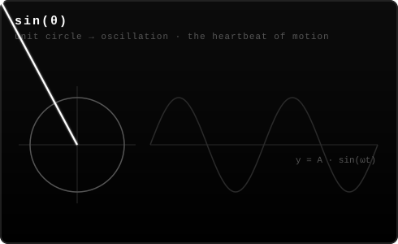
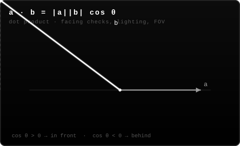
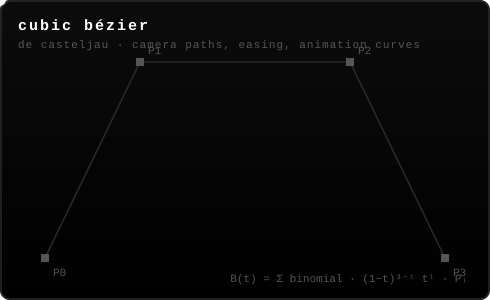

<div align="center">



<br/><br/>

<a href="https://github.com/dhanilka">
  
</a>

<br/>


<a href="https://github.com/dhanilka?tab=followers"></a>
<a href="https://github.com/dhanilka?tab=repositories"></a>

</div>

<br/>

## whoami

```typescript
const dhanilka = {
  location: "Sri Lanka",
  currentFocus: "VR survival horror for Meta Quest — built in Unity",
  daylight: ["Unity + XR Interaction Toolkit", "C#", "Quest standalone optimization"],
  moonlight: ["Node.js APIs", "React / Next.js frontends", "Swift macOS apps"],
  alsoShips: ["Unity Editor tooling", "Chrome extensions", "Bots & scrapers",
              "AI-powered backends", "WebXR players"],
  philosophy: "If it doesn't exist, build it. If it's tedious, automate it.",
};
```

- **Right now:** deep in a **VR zombie survival game** for Meta Quest — enemy AI state machines, hit detection, hand-pose interaction systems
- **Building [XRMan](https://github.com/dhanilka/XRMan)** — a Unity XR editor package that automates VR project setup and validation
- **Shipping native macOS utilities** in Swift — clipboard managers, battery monitors
- **Automating everything** — bots, scrapers, CI experiments, AI pipelines

<br/>

## the mathematics of worlds

> Every frame you've ever played was drawn by math. These are the equations I work with daily — animated by hand, in pure SVG.

<div align="center">

<table border="0">
<tr>
<td width="50%"></td>
<td width="50%"></td>
</tr>
<tr>
<td width="50%"></td>
<td width="50%"></td>
</tr>
</table>



</div>

<br/>

## arsenal

<div align="center">

**engines & xr**


**languages**


**web & mobile**


**data & cloud**


**tools**


</div>

<br/>

## the repo universe

> **116 repositories** across six domains — a sampler of the public ones:

| Domain | What lives there | Highlights |
|:---|:---|:---|
| **XR / Game Dev** | Unity VR games, XR tooling, WebXR | [`XRMan`](https://github.com/dhanilka/XRMan) · [`vr-player`](https://github.com/dhanilka/vr-player) |
| **Native macOS** | Swift desktop utilities | [`ClipboardMacOS`](https://github.com/dhanilka/ClipboardMacOS) · [`BatteryManager`](https://github.com/dhanilka/BatteryManager) |
| **Full-Stack Web** | Node · React · Next · .NET | [`SDAT`](https://github.com/dhanilka/SDAT) · [`MERN-Student-CRUD-API`](https://github.com/dhanilka/MERN-Student-CRUD-API) · [`cv_mng`](https://github.com/dhanilka/cv_mng) |
| **Bots & Automation** | WhatsApp, Telegram, scrapers | [`WA-STICK-BOT-v2`](https://github.com/dhanilka/WA-STICK-BOT-v2) · [`Telegram-Music-Bot`](https://github.com/dhanilka/Telegram-Music-Bot) · [`Google-Reviews-Scrapper`](https://github.com/dhanilka/Google-Reviews-Scrapper) |
| **Browser Extensions** | Chrome power tools | [`GyroSearch`](https://github.com/dhanilka/GyroSearch) · [`WebTimeTracker`](https://github.com/dhanilka/WebTimeTracker) · [`Question-master-EXT`](https://github.com/dhanilka/Question-master-EXT) |
| **AI & Experiments** | RAG, distributed AI, research | [`LightRAG`](https://github.com/dhanilka/LightRAG) · [`exo`](https://github.com/dhanilka/exo) · [`Link-Crawler`](https://github.com/dhanilka/Link-Crawler) |

<br/>

## activity

<div align="center">


<br/><br/>


</div>

<br/>

<div align="center">


</div>
